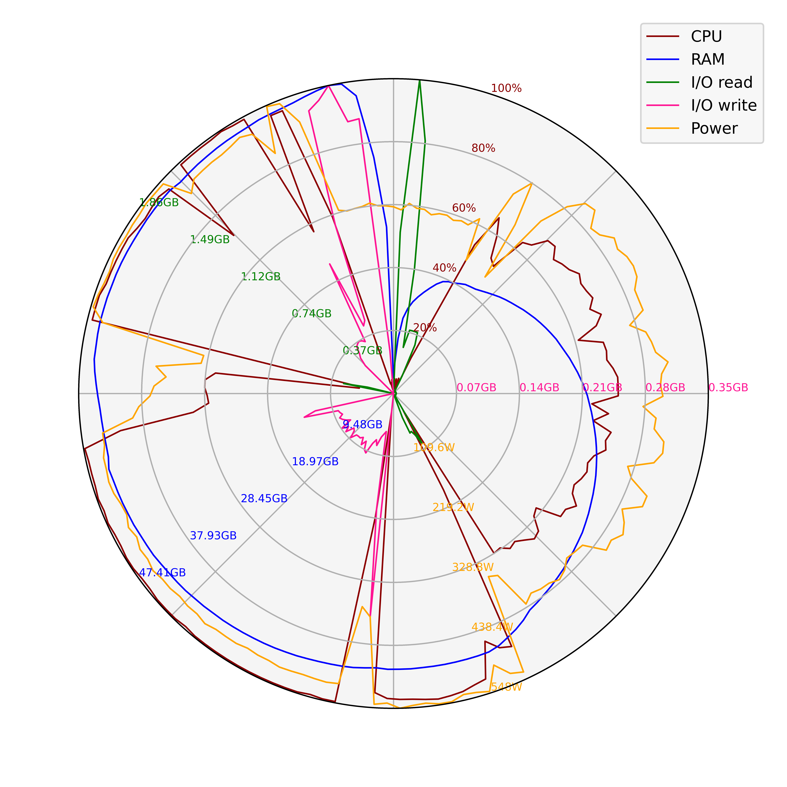
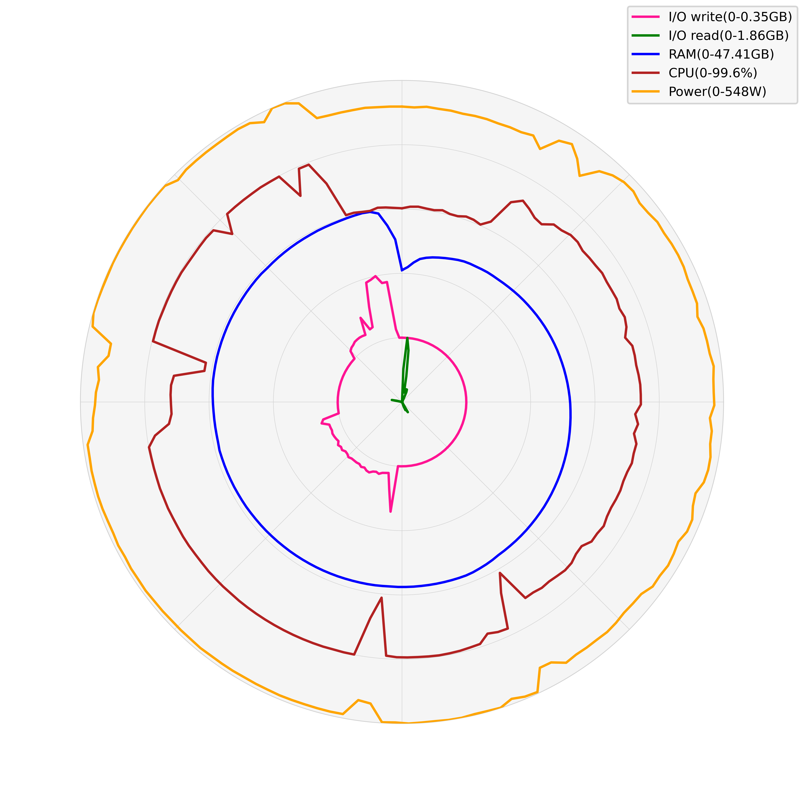

# 高性能计算集群资源使用情况雷达图绘制

## 简介

本项目是一个基于Python的雷达图绘制工具，用于展示资源使用情况。它使用`matplotlib`库来绘制雷达图，并提供了多种配置选项，包括颜色、标签、数据点等。用户可以根据自己的需求，自定义雷达图的样式和内容。
有两个版本：
1. hpc_resource_radar.py：将所有指标统一缩放到同一尺度，在同一坐标系下使用不同比例尺进行展示，方便不同指标之间进行比较。
2. hpc_resource_radar_split.py：将雷达图由内到外分为若干层，每层展示一个指标，方便单个指标的分析。

## 使用方法

1. 安装依赖库
   - numpy
   - matplotlib

2. 运行脚本

   在自己的Python脚本中导入函数：

   ```python
   from hpc_resource_radar import hpc_resource_radar
   ```
   或
   ```python
   from hpc_resource_radar_split import hpc_resource_radar_split
   ```

   读取监控文件中的数据，分别将每一帧监控的CPU使用率、内存使用量（单位GB）、文件系统接收带宽（IO读带宽，单位GB）、文件系统发送带宽（IO写带宽，单位GB）、功耗（单位W）存放到cpu、ram、pfs_recv、pfs_send、power列表中。列表中元素格式应为整型或浮点数，且列表长度相同，形如：
   ```python
   cpu = [99.1,99.2,99.3,99.4,99.5]
   ram = [210,220,230,240,250]
   pfs_recv = [1,2,3,4,5]
   pfs_send = [0.1,0.2,0.3,0.4,0.5]
   power = [401,402,403,404,405]
   ```
   然后调用函数：

   ```python
   hpc_resource_radar(cpu,ram,pfs_recv,pfs_send,power,image_path)
   ```
   或
   ```python
   hpc_resource_radar_split(cpu,ram,pfs_recv,pfs_send,power,image_path)
   ```
   参数说明：
   - cpu：CPU使用率列表，单位为百分比
   - ram：内存使用量列表，单位为GB
   - pfs_recv：文件系统接收带宽列表，单位为GB
   - pfs_send：文件系统发送带宽列表，单位为GB
   - power：功耗列表，单位为W
   - image_path：图片保存路径，包括文件名和后缀名，例如：`"./example.png"`
   列表中元素格式应为整型或浮点数，且列表长度相同。

## 示例
直接执行以下命令：
```python
python hpc_resource_radar.py
```
或
```python
python hpc_resource_radar_split.py
```
将读取example.txt文件中的数据，绘制雷达图，并保存到example.png和example_split.png文件中。

## 示例图片
hpc_resource_radar函数将所有指标统一缩放到同一尺度，在同一坐标系下使用不同比例尺进行展示，方便不同指标之间进行比较。

hpc_resource_radar_split函数将雷达图由内到外分为若干层，每层展示一个指标，方便单个指标的分析。

